[](https://github.com/Myilvaganan/)

# FLoraShop MERN APP

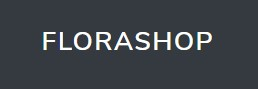

# Project Done By:  <a href="https://github.com/Myilvaganan" noreferrer target="_blank">Myilvaganan</a>

# E- Commerce website to sell and buy Products

## Deployed Website

https://florashopapp.herokuapp.com

## Github Repository

https://github.com/Myilvaganan/florashop

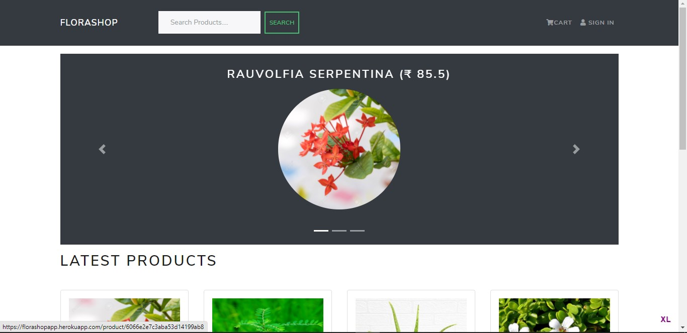


#### User authentication/login system

Authentication is needed for clients to use the application, as a user and profile are needed to make communicate with developers - the primary purpose of the application. 

- Users only have permissions to use their dedicated parts of the website depending on their permission.


#### Dashboards
Track your money through income, expenses, and savings. Dashboard will display all the details and able to add new transaction and view it.


## Tech Stack

- MongoDB
- Express.js
- React
- Node.js
- React Context API
- Mongoose
- MaterialUi
- Heroku

## What Am I Using and Why ?

```
BACKEND:
  - bcryptjs                    Password encryption
  - dotenv                      Storing sensitive information
  - express                     Backend server
  - express-validator           Server side form validation
  - jsonwebtoken                Securing API endpoints and authorization
  - mongoose                    MongoDB ODM

FRONTEND:
  - axios                       Making API calls
  - moment & react-moment       Formatting dates and time
  - react-Context API           State management
```

##Introduction to Techs

FLoraShop is a full stack application built on the MERN stack (MongoDB, Express, React and Node) and utilises a range of open source libraries to assist with accelerating development time and improving authentication security. MongoDB was chosen as the Database Management System (DBMS) for several reasons, including that it affords dynamic and flexible document schemas that can contain a wide range of data attached to both patients and doctors respectively. Furthermore, MongoDB stores document data in Binary JSON (BSON), which integrates seamlessly with the core JavaScript-driven technologies of FLoraShop’s tech stack.

React is utilised on the front-end of FLoraShop, and is primarily responsible for handling the view layer of the application, including the user interface (UI), text, images, and making networking requests to API endpoints. The framework supports building reusable components that dramatically improve code quality, efficiency, and the scalability of the codebase. Express and Node are the server-side technologies that handle the backend business logic of FLoraShop, including routing, middleware integration, and network requests to RESTful API endpoints. React-Redux is used for global state control and management of themes across the entire application.

A JSON Web Token strategy for authentication of users will be employed. It allows RESTful endpoints to be authenticated without needing sessions. A local username and password authentication strategy is also being considered, to allow users to authenticate using a username and password stored in the Node.js application, to provide a familiar login flow for users of the application. 

Mongoose will be used with our MongoDB implementation, it is an Object Data Modelling (ODM) library for use with MongoDB and Node.js. It assists in managing the relationships between data, provides schema validation and is used to translate between objects in Node.js code and the representation of those objects in MongoDB.


FLoraShop is a single page application (SPA) that utilises the dashboard component as the main wrapper element for rendering various view layers.


## Wireframes


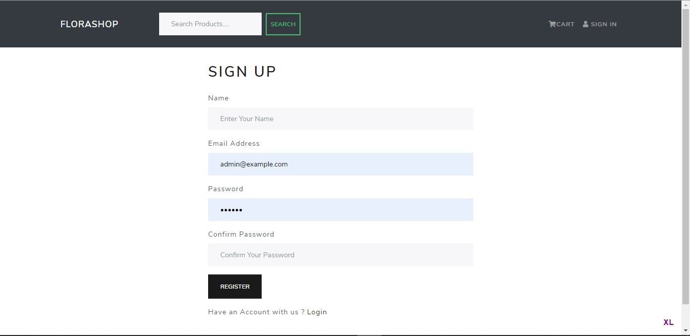
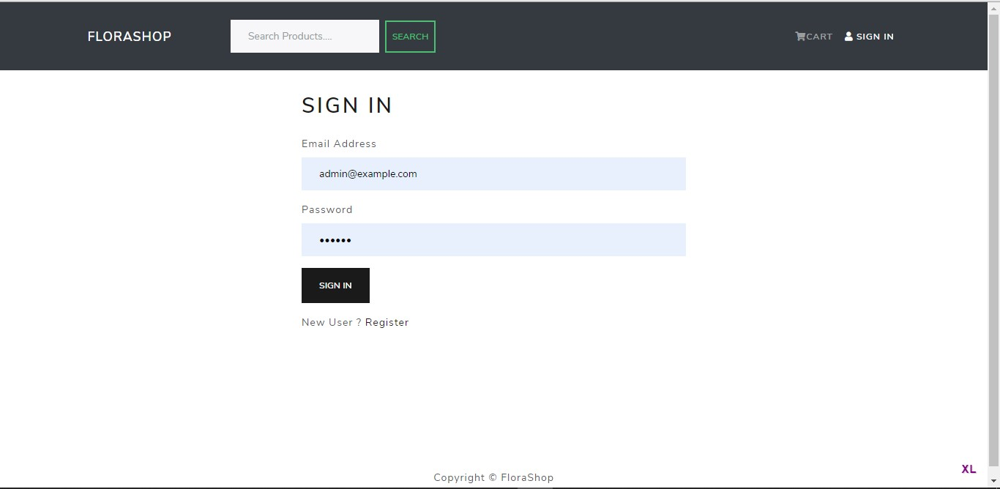
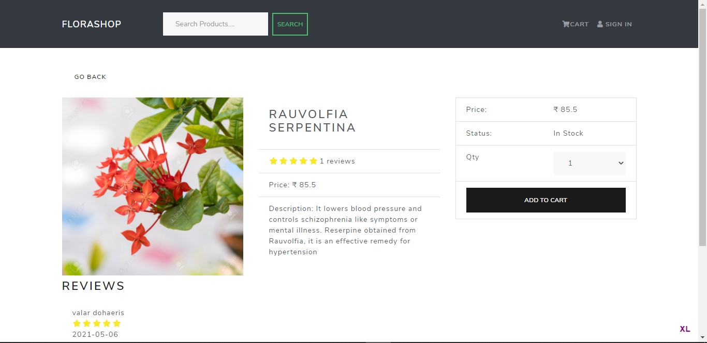
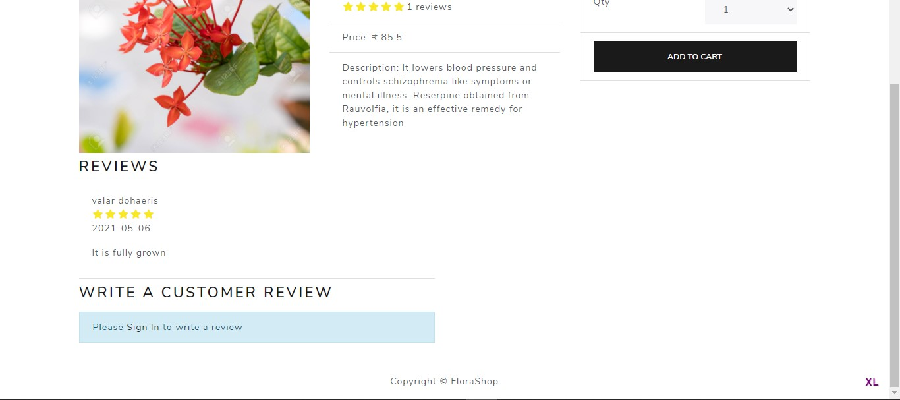
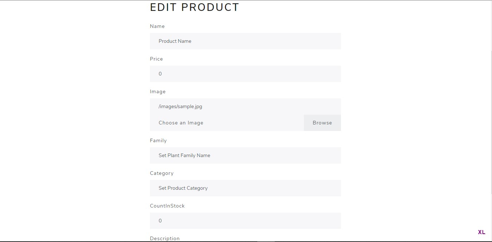
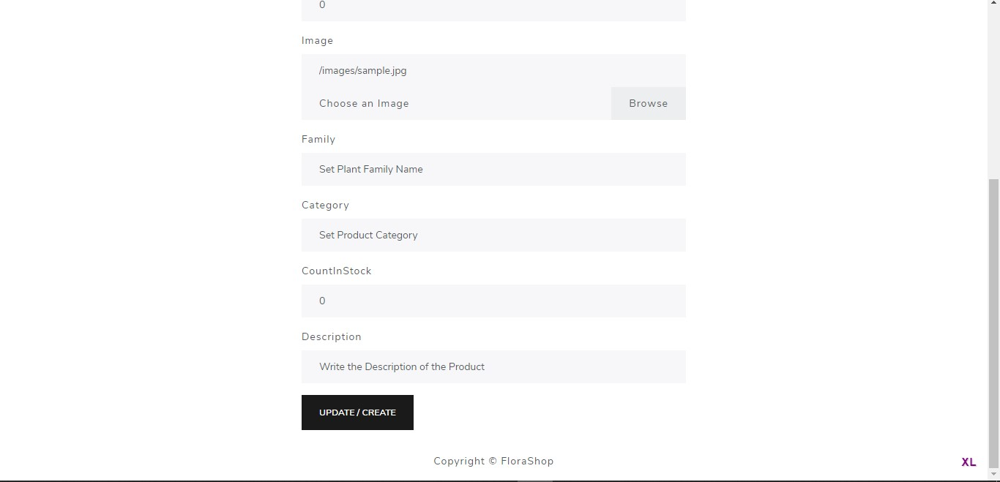
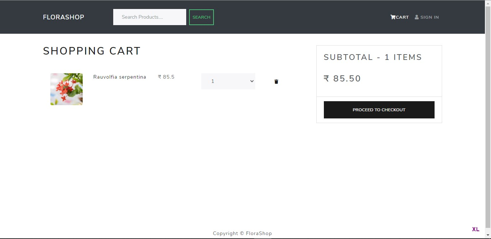
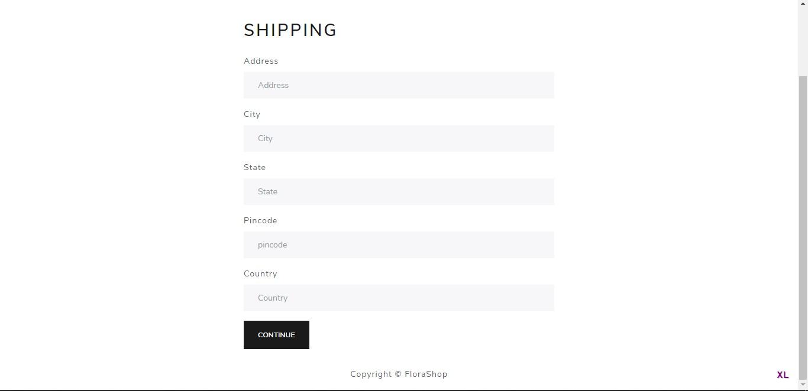
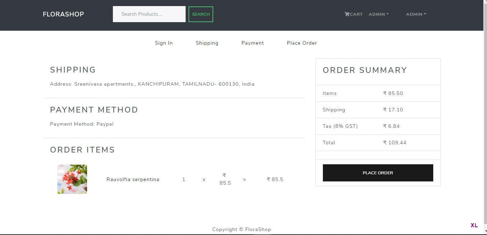
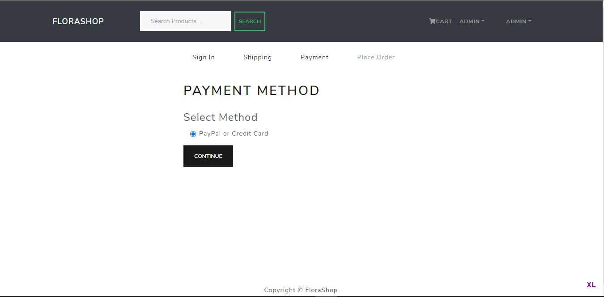
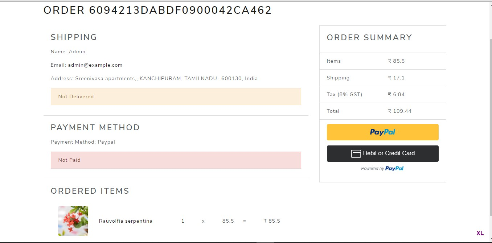

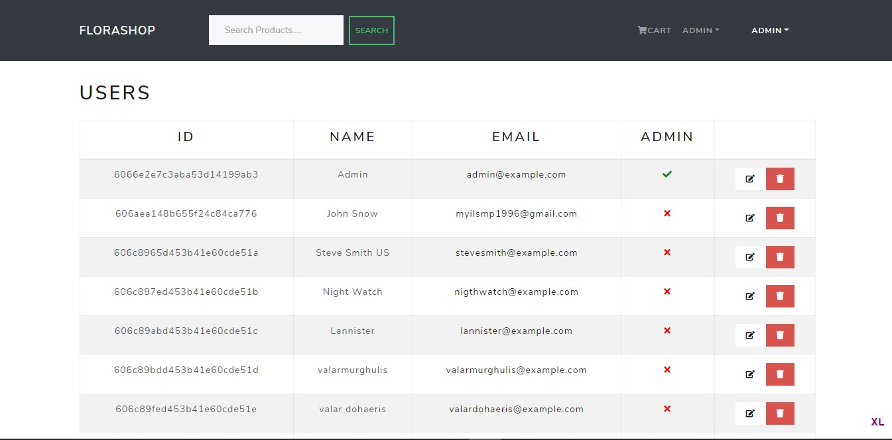
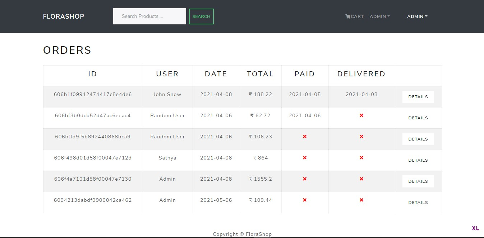
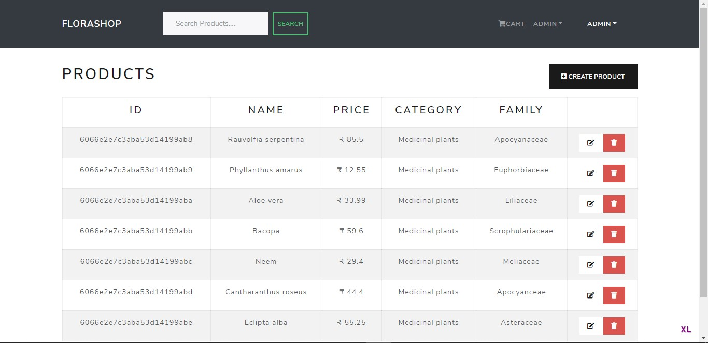


#### Thankyou...


